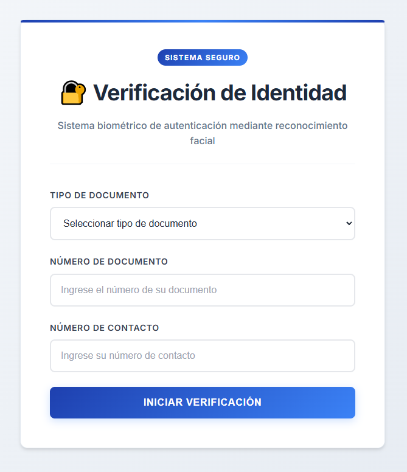

# Rekognition PoC - Verificación de Identidad

Sistema de autenticación (fase 1) mediante reconocimiento facial. El sistema cuenta con 'Registro' y 'Login', Para usuarios nuevos se activa 'Registro' en el cual deberán tomar captura a su documento de indentidad y ´posteriormente tomarse una foto de rostro para la validación. Para usuarios ya registrados el sistema solo pide foto de rostro y se compara con el documento previamente guardado.

## ⚡Observación

Este sistema presenta algunos inconvenientes, los cuales son: 
- No se valida correctamente el documento de identidad: Solo se realiza DetectFaces.
- No se valida que el usuario efectivamente esté vivo (liveness)

 **Para la fase 2 se espera solucionar estos inconvenientes con Textract y API Liveness respectivamente**
 
## ⚡Instalación y despliegue

### Clonar repositorio
git clone https://github.com/lhuarcayat/Rekognititon_Demo_AWS.git
cd rekognition-poc
### Crear entorno virtual Python
conda create -p venv python==3.12
conda activate venv/
### Instalar dependencias
pip install -r requirements.txt
### Despliegue
cdk bootstrap
cdk deploy
### Configuración
python scripts/update_frontend_config.py RekognitionPocStack

